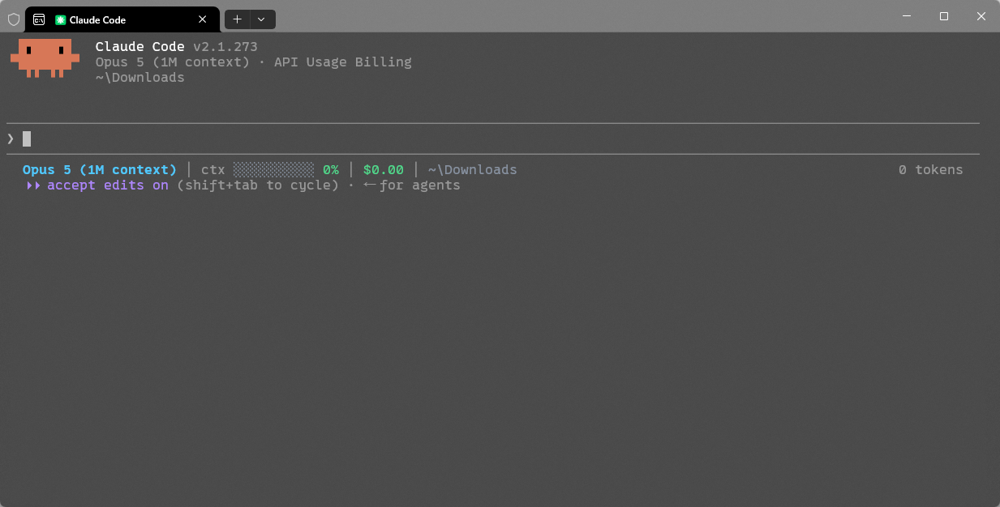
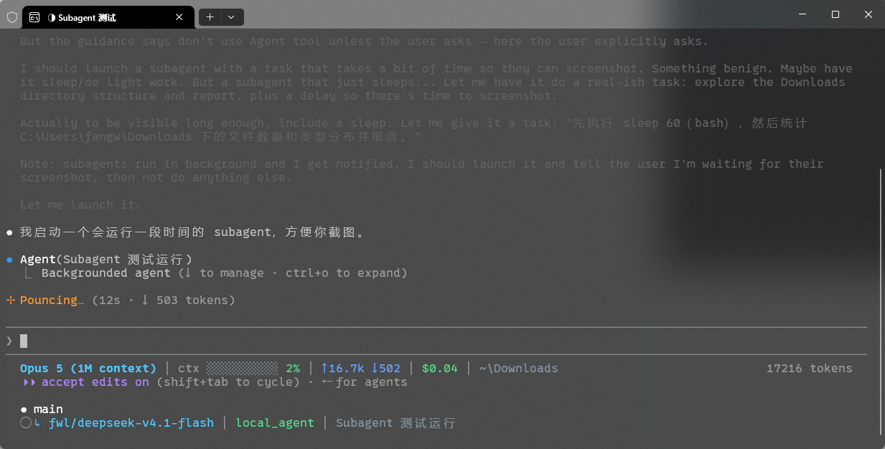
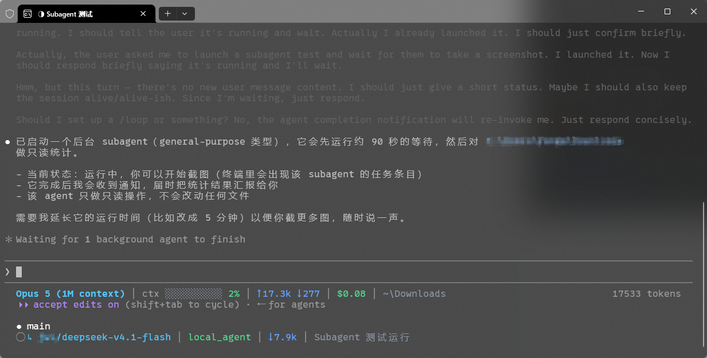

# cc-status-line

A fast, dependency-free status line for [Claude Code](https://claude.com/claude-code), [Antigravity CLI (`agy`)](https://antigravity.google), [OpenAI Codex CLI](https://github.com/openai), and other AI coding CLIs — a single line of context for your main session, plus a compact line per running subagent.

[English](#english) | [中文](#中文)

---

## English

### Preview

<!-- Screenshot goes to assets/preview.png — drop the file in, no other change needed. -->


```text
# Claude Code session (with OAuth rate limits):
Opus 5 │ main ✓ │ ctx ████░░░░░░ 42% │ ↑15.0k ↓3.2k │ 5h 76% · 2h 15m │ 7d 59% │ ~/Codes/my-project

# Claude Code session (API key / token-billed):
Opus 5 │ main ✓ │ ctx ████░░░░░░ 42% │ ↑15.0k ↓3.2k │ $0.37 │ ~/Codes/my-project

# Antigravity CLI session (with official Google OAuth quota):
Gemini 2.5 Pro │ Idle │ main ✓ │ ctx ████░░░░░░ 42% │ ↑85.0k ↓15.0k │ 5h 80% · 1h │ 7d 94% · 6d │ ~/Codes/my-project

# OpenAI Codex CLI / GPT session:
GPT-4o │ main ✓ │ ctx ███░░░░░░░ 26% │ ↑12.0k ↓3.5k │ 5h 85% · 3h │ ~/Codes/my-project

# Subagent line (Claude Code / Antigravity CLI):
↳ Opus 5 │ Explore │ ctx ███████░░░ 68% │ ↓12.4k │ find all status line configs
↳ Gemini 2.5 Flash │ Researcher │ ctx ███░░░░░░░ 30% │ ↓5.4k │ search codebase
```

### Subagent states

A subagent line is built up in stages. These two screenshots show the same agent at each stage:

<!-- Screenshots go to assets/subagent_new.png and assets/subagent_token.png — drop the files in, no other change needed. -->



- **Just opened** — the line renders from model, agent type/role, task description/prompt and, when the context window is already known, the context bar. Token counts have not arrived yet.
- **With token data** — the `↓` token segment fills in as the agent runs.

Either stage degrades cleanly: a segment whose data is missing is omitted rather than rendered as a placeholder.

### Features

- **Multi-CLI compatibility** — seamless support for Claude Code, Antigravity CLI (`agy`), OpenAI Codex CLI (`codex`), and generic AI coding assistants with automatic CLI detection.
- **Always-on context tokens** — context token usage (`↑` input and `↓` output) is always visible across all sessions.
- **Official OAuth quota detection** — automatically detects official OAuth subscriptions and displays standard buckets (`5h`, `7d`, `1m`) with remaining percentage and reset countdown (e.g. `5h 76% · 2h 15m │ 7d 59%`).
- **Context usage bar** — color-coded green / yellow / red at 65% and 85% thresholds.
- **Git state** — current branch (falls back to short SHA on detached HEAD) with a `✓` / `●` clean-or-dirty marker.
- **Session cost / Quota** — total USD for API token-billed sessions, or official OAuth quotas for subscription sessions.
- **Shortened workspace path** — `$HOME` collapses to `~`, deep paths to `…/last/three/segments`.
- **Per-subagent lines** — each running subagent gets its own line with model, role/type, context usage and task description, fully compatible with Antigravity subagents and Claude Code.
- **Zero dependencies** — Python 3 standard library only. No install step, no virtualenv, no build.
- **Never blocks your prompt** — git calls are capped at a 0.5s timeout, and any failure degrades to a blank field instead of an error.

### Requirements

- Python 3.8+
- `git` on `PATH` (optional — the git segment is simply omitted without it)
- A terminal with truecolor support for the RGB palette

### Installation & Configuration

#### Quick Setup via AI Coding Assistants (Claude Code, Codex, etc.)

You can let your AI agent configure `cc-status-line` automatically. Copy and send the following instruction to your assistant (**Claude Code**, **OpenAI Codex**, **Antigravity**, etc.):

```text
Please configure cc-status-line for my environment by following the instructions in AGENTS.md in this repository. Automatically determine the absolute path to statusline.py and safely update my CLI settings.
```

The repository includes [AGENTS.md](AGENTS.md) as the standard universal guide for AI agents to inspect and configure automatically.

---

#### Manual Setup

1. Clone the repository anywhere you like:

   ```bash
   git clone https://github.com/fangweilong/cc-status-line.git
   ```

2. Configure according to your CLI:

   #### Option A: Claude Code (`~/.claude/settings.json`)

   ```json
   {
     "statusLine": {
       "type": "command",
       "command": "python /absolute/path/to/cc-status-line/statusline.py main",
       "padding": 0
     },
     "subagentStatusLine": {
       "type": "command",
       "command": "python /absolute/path/to/cc-status-line/statusline.py subagent"
     }
   }
   ```

   See [examples/settings.json](examples/settings.json).

   #### Option B: Antigravity CLI (`~/.gemini/antigravity-cli/settings.json`)

   ```json
   {
     "statusLine": {
       "type": "command",
       "command": "python /absolute/path/to/cc-status-line/statusline.py main",
       "enabled": true,
       "padding": 0,
       "stack_with_default": false
     }
   }
   ```

   See [examples/antigravity-settings.json](examples/antigravity-settings.json). You can also run `/statusline python /path/to/statusline.py main` inside `agy`.

   #### Option C: OpenAI Codex CLI (`~/.codex/config.toml`)

   Codex CLI natively manages its footer status line via built-in item identifiers in `~/.codex/config.toml`:

   ```toml
   [tui]
   status_line = [
       "model-with-reasoning",
       "project-root",
       "current-dir",
       "git-branch",
       "five-hour-limit",
       "weekly-limit",
       "context-used",
       "context-window-size",
       "used-tokens"
   ]
   status_line_use_colors = true
   ```

   See [examples/codex-config.toml](examples/codex-config.toml).
   If you invoke Codex inside custom terminal scripts, tmux, or shell wrappers, you can call `cc-status-line` directly:
   `python /path/to/cc-status-line/statusline.py codex`

3. Restart your CLI, or run `/statusline` to confirm the setting was picked up.

#### Path notes

- Use **forward slashes**, even on Windows (`python C:/tools/cc-status-line/statusline.py main`).
- Quote the path if it contains spaces.
- On Windows, `python` must resolve to a real interpreter. If you rely on the `py` launcher, use `py` in the command instead.
- On macOS / Linux, make the entry executable and use the shebang if you prefer:

  ```bash
  chmod +x statusline.py
  ```

### Usage & Modes

```bash
# Main session line (auto-detects Claude Code, Antigravity CLI, Codex, or generic)
python statusline.py main

# Explicit CLI selection:
python statusline.py main --cli antigravity
python statusline.py main --cli claude
python statusline.py main --cli codex

# Direct shorthand aliases:
python statusline.py agy
python statusline.py antigravity
python statusline.py claude
python statusline.py cc
python statusline.py codex

# Subagent lines (outputs {"id", "content"} JSON per task):
python statusline.py subagent
```

### Errors

The entry point validates its mode argument and never fails silently. Because a status line has no stderr channel, every error is printed to **stdout** as a single visible line:

```text
⚠ statusline: missing mode argument │ check your settings.json │ statusline.py <main|subagent|agy|claude|codex> [--cli <name>]
⚠ statusline: unknown mode 'mian' │ expected main, subagent, agy, claude, or codex │ statusline.py <main|subagent|agy|claude|codex> [--cli <name>]
⚠ statusline: KeyError: 'foo' │ render failed │ statusline.py <main|subagent|agy|claude|codex> [--cli <name>]
```

| Case | Behavior | Exit code |
| --- | --- | --- |
| No argument | `missing mode argument` line | 1 |
| Unrecognized argument | `unknown mode '...'` line | 1 |
| Unexpected exception during rendering | `ExceptionType: message` line | 1 |
| Empty or malformed stdin JSON | No error — renders a minimal line (by design) | 0 |

### Input fields & OAuth Quota

The renderer reads defensively and tolerates missing keys — each field below is tried in order, and anything absent is skipped.

| Segment | Fields read (first match wins) |
| --- | --- |
| Model | `model.display_name` → `model.name` → `model.id` → CLI default (`Gemini` / `Claude` / `Codex` / `Agent`) |
| State | `agent_state` → `state` (e.g., `Idle`, `Thinking`, `Auth`) |
| Workspace | `workspace.current_dir` → `workspace.project_dir` → `cwd` |
| Context | `context_window.used_percentage` → `100 - context_window.remaining_percentage` |
| Tokens | `context_window.total_input_tokens` → `context_window.input_tokens` → `input_tokens` → `tokens.input`, same for output |
| Cost | `cost.total_cost_usd` |
| Quota | `quota.remaining_fraction` / `quota.<model>.remaining_fraction` (with `reset_in_seconds` or `reset_time` countdown) |

#### Quota Detection Rules

1. Checks payload for explicit OAuth auth type (`auth.type` or `auth_type`).
2. Checks payload for `quota` metrics.
3. Checks local Google OAuth credentials (`~/.gemini/oauth_creds.json`, `~/.gemini/google_accounts.json`, etc.).
4. If an explicit API key (`GEMINI_API_KEY` / `GOOGLE_API_KEY` / `OPENAI_API_KEY`) is active, OAuth quota is bypassed.
5. Quota color-codes automatically: **green** (>= 50%), **yellow** (20% ~ 50%), **red** (< 20%).

### Project layout

```text
statusline.py            # CLI entry point (main | subagent | agy | claude | codex)
AGENTS.md                # Universal AI Agent reading and installation guide
statusline/
  main.py                # main session status line renderer
  subagent.py            # per-subagent lines renderer
  quota.py               # official OAuth detection and quota formatting
  common.py              # stdin parsing, CLI detection, git, path, progress bar
  colors.py              # ANSI truecolor palette
examples/
  settings.json              # Claude Code configuration example
  antigravity-settings.json  # Antigravity CLI configuration example
  codex-config.toml          # OpenAI Codex CLI configuration example
```

### License

[MIT](LICENSE)

---

## 中文

### 效果预览

<!-- 截图放到 assets/preview.png，放进去即可，无需改其他内容。 -->


```text
# Claude Code 会话（包含 OAuth 速率限制）：
Opus 5 │ main ✓ │ ctx ████░░░░░░ 42% │ ↑15.0k ↓3.2k │ 5h 76% · 2h 15m │ 7d 59% │ ~/Codes/my-project

# Claude Code 会话（API Key 按量计费）：
Opus 5 │ main ✓ │ ctx ████░░░░░░ 42% │ ↑15.0k ↓3.2k │ $0.37 │ ~/Codes/my-project

# Antigravity CLI 会话（官方 Google OAuth 额度）：
Gemini 2.5 Pro │ Idle │ main ✓ │ ctx ████░░░░░░ 42% │ ↑85.0k ↓15.0k │ 5h 80% · 1h │ 7d 94% · 6d │ ~/Codes/my-project

# OpenAI Codex CLI / GPT 会话：
GPT-4o │ main ✓ │ ctx ███░░░░░░░ 26% │ ↑12.0k ↓3.5k │ 5h 85% · 3h │ ~/Codes/my-project

# Subagent 状态行（兼容 Claude Code 与 Antigravity CLI）：
↳ Opus 5 │ Explore │ ctx ███████░░░ 68% │ ↓12.4k │ 查找所有 status line 配置
↳ Gemini 2.5 Flash │ Researcher │ ctx ███░░░░░░░ 30% │ ↓5.4k │ 检索代码库
```

### Subagent 状态

subagent 状态行是分阶段拼出来的。下面两张截图是同一个 agent 在不同阶段的样子：

<!-- 截图放到 assets/subagent_new.png 和 assets/subagent_token.png，放进去即可，无需改其他内容。 -->


- **刚打开** —— 状态行由模型、agent 类型/角色、任务描述/提示词，以及已知上下文窗口时的进度条拼出，此时还没有 token 计数。
- **有 token 数据时** —— 随着 agent 运行，`↓` token 片段会填充进来。

两种阶段都做了降级：某个片段的数据缺失时会被直接省略，而不是渲染成占位符。

### 特性

- **多 CLI 兼容** —— 自动检测并支持 Claude Code、Antigravity CLI（`agy`）、OpenAI Codex CLI（`codex`）以及通用 AI 编码 CLI。
- **上下文 Token 常驻显示** —— 上下文 token 统计（`↑` 输入、`↓` 输出）在所有会话中全程常驻显示，初始为 `↑0 ↓0`。
- **官方 OAuth 额度识别** —— 自动识别官方 OAuth 订阅，按标准周期显示 `5h`、`7d`、`1m` 等额度剩余与倒计时（如 `5h 76% · 2h 15m │ 7d 59%`），额度充足为绿、警戒为黄、见底为红。
- **上下文用量进度条** —— 按阈值着色，65% 转黄、85% 转红。
- **Git 状态** —— 显示当前分支（detached HEAD 时回退到短 SHA），并用 `✓` / `●` 标记工作区是否干净。
- **花费 / 额度双模** —— API 密钥按 Token 计费显示 USD 金额，官方 OAuth 订阅显示周期额度。
- **路径缩写** —— `$HOME` 折叠为 `~`，过深的路径折叠为 `…/最后/三级/目录`。
- **Subagent 逐行显示** —— 每个运行中的 subagent 单独一行，全面兼容 Antigravity CLI 的 `role`、`prompt` 及 Claude Code 的子任务。
- **零依赖** —— 只用 Python 3 标准库。无需安装、无需虚拟环境、无需构建。
- **不阻塞输入** —— git 调用最长 0.5 秒超时，任何异常都降级为空字段而不是报错。

### 环境要求

- Python 3.8+
- `PATH` 中有 `git`（可选，缺失时整段 git 信息不显示）
- 终端支持 truecolor，否则 RGB 配色会失真

### 安装配置

#### 方式 A：AI 助手（Claude Code / Codex）一键自动安装配置

你可以直接让你的 AI 助手自动阅读仓库并完成安装配置。将以下指令直接发送给 **Claude Code**、**OpenAI Codex**、**Antigravity** 等助手：

```text
请帮我将当前目录的 cc-status-line 安装并配置到我的 CLI 环境中。请阅读仓库中的 AGENTS.md 指引，自动识别 statusline.py 的绝对路径并安全写入我的配置文件。
```

仓库根目录已提供标准通用的 [AGENTS.md](AGENTS.md) 智能体指引，供各类 AI Agent 自动阅读并执行配置。

---

#### 方式 B：手动配置

1. 克隆仓库到任意位置：

   ```bash
   git clone https://github.com/fangweilong/cc-status-line.git
   ```

2. 根据使用的 CLI 进行配置：

   #### 配置方式 1：Claude Code（`~/.claude/settings.json`）

   ```json
   {
     "statusLine": {
       "type": "command",
       "command": "python /absolute/path/to/cc-status-line/statusline.py main",
       "padding": 0
     },
     "subagentStatusLine": {
       "type": "command",
       "command": "python /absolute/path/to/cc-status-line/statusline.py subagent"
     }
   }
   ```

   可参考 [examples/settings.json](examples/settings.json)。

   #### 配置方式 2：Antigravity CLI（`~/.gemini/antigravity-cli/settings.json`）

   ```json
   {
     "statusLine": {
       "type": "command",
       "command": "python /absolute/path/to/cc-status-line/statusline.py main",
       "enabled": true,
       "padding": 0,
       "stack_with_default": false
     }
   }
   ```

   可参考 [examples/antigravity-settings.json](examples/antigravity-settings.json)。亦可在 `agy` 交互界面中直接执行 `/statusline python /path/to/statusline.py main`。

   #### 配置方式 3：OpenAI Codex CLI（`~/.codex/config.toml`）

   Codex CLI 原生在 `~/.codex/config.toml` 中通过内置字段管理底部状态栏：

   ```toml
   [tui]
   status_line = [
       "model-with-reasoning",
       "project-root",
       "current-dir",
       "git-branch",
       "five-hour-limit",
       "weekly-limit",
       "context-used",
       "context-window-size",
       "used-tokens"
   ]
   status_line_use_colors = true
   ```

   可参考 [examples/codex-config.toml](examples/codex-config.toml)。
   若你在自定义脚本、tmux 或 Shell 包装器中使用 Codex，亦可直接调用：
   `python /absolute/path/to/cc-status-line/statusline.py codex`

3. 重启 CLI 或执行 `/statusline` 确认配置生效。

#### 路径注意事项

- 即使在 Windows 上也请使用**正斜杠**：`python C:/tools/cc-status-line/statusline.py main`。
- 路径含空格时请加引号。
- Windows 上 `python` 必须能解析到真实解释器。若你依赖 `py` 启动器，请把命令里的 `python` 换成 `py`。
- macOS / Linux 下也可以加执行权限后直接用 shebang：

  ```bash
  chmod +x statusline.py
  ```

### 用法与模式

```bash
# 主会话状态行（自动识别 Claude Code / Antigravity CLI / Codex / 通用 CLI）
python statusline.py main

# 显式指定 CLI 类型：
python statusline.py main --cli antigravity
python statusline.py main --cli claude
python statusline.py main --cli codex

# 简写别名：
python statusline.py agy
python statusline.py antigravity
python statusline.py claude
python statusline.py cc
python statusline.py codex

# Subagent 模式（输出各子任务 JSON）：
python statusline.py subagent
```

### 错误提示

入口脚本会校验模式参数，不会静默失败。由于状态栏没有 stderr 通道，所有错误都打印到 **stdout**，输出为一行可见的提示：

```text
⚠ statusline: missing mode argument │ check your settings.json │ statusline.py <main|subagent|agy|claude|codex> [--cli <name>]
⚠ statusline: unknown mode 'mian' │ expected main, subagent, agy, claude, or codex │ statusline.py <main|subagent|agy|claude|codex> [--cli <name>]
⚠ statusline: KeyError: 'foo' │ render failed │ statusline.py <main|subagent|agy|claude|codex> [--cli <name>]
```

| 情况 | 行为 | 退出码 |
| --- | --- | --- |
| 未传参数 | 输出 `missing mode argument` 提示行 | 1 |
| 参数不合法 | 输出 `unknown mode '...'` 提示行 | 1 |
| 渲染过程中出现未预期异常 | 输出 `异常类型: 消息` 提示行 | 1 |
| stdin JSON 为空或格式错误 | 不报错，输出最小可用内容（有意为之） | 0 |

### 输入字段与官方 OAuth 额度

渲染逻辑做了充分的容错，下表字段按顺序逐个尝试，缺失即跳过。

| 片段 | 读取字段（命中即用） |
| --- | --- |
| 模型 | `model.display_name` → `model.name` → `model.id` → CLI 默认值（`Gemini` / `Claude` / `Codex` / `Agent`） |
| 状态 | `agent_state` → `state`（如 `Idle`、`Thinking`、`Auth`） |
| 工作目录 | `workspace.current_dir` → `workspace.project_dir` → `cwd` |
| 上下文 | `context_window.used_percentage` → `100 - context_window.remaining_percentage` |
| Token | `context_window.total_input_tokens` → `context_window.input_tokens` → `input_tokens` → `tokens.input`，输出同理 |
| 花费 | `cost.total_cost_usd` |
| 额度 | `quota.remaining_fraction` / `quota.<model>.remaining_fraction`（支持 `reset_in_seconds` 或 `reset_time` 倒计时） |

#### 官方 OAuth 判定规则

1. 优先读取输入 payload 中的鉴权信息（`auth.type` 或 `auth_type` 为 oauth / google）。
2. 读取 payload 或本地缓存中的 `quota` 数据。
3. 检测本地 Google OAuth 登录凭据（`~/.gemini/oauth_creds.json` 等）。
4. 若显式配置了 API Key 环境变量（如 `GEMINI_API_KEY` / `GOOGLE_API_KEY` / `OPENAI_API_KEY`），则判定为 API 模式，不显示 OAuth 额度。
5. 额度颜色：**绿色**（>= 50%）、**黄色**（20% ~ 50%）、**红色**（< 20%）。

### 项目结构

```text
statusline.py            # 入口脚本（支持 main | subagent | agy | claude | codex）
AGENTS.md                # 跨 AI Agent 通用阅读与安装指南
statusline/
  main.py                # 主会话状态行渲染
  subagent.py            # 各 subagent 状态行渲染
  quota.py               # 官方 OAuth 判定与配额渲染
  common.py              # stdin 解析、CLI 自动识别、git、路径、进度条
  colors.py              # ANSI truecolor 调色板
examples/
  settings.json              # Claude Code 配置示例
  antigravity-settings.json  # Antigravity CLI 配置示例
  codex-config.toml          # OpenAI Codex CLI 配置示例
```

### 许可证

[MIT](LICENSE)
