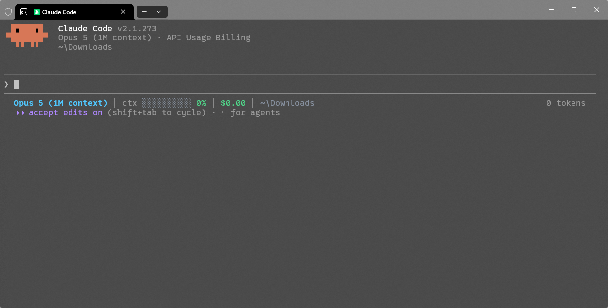
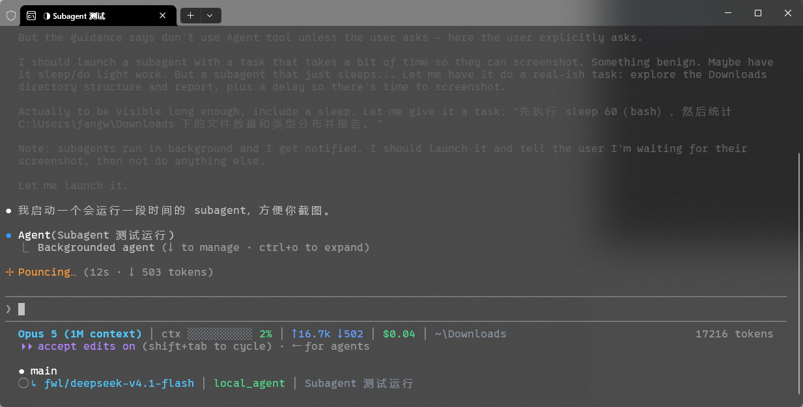
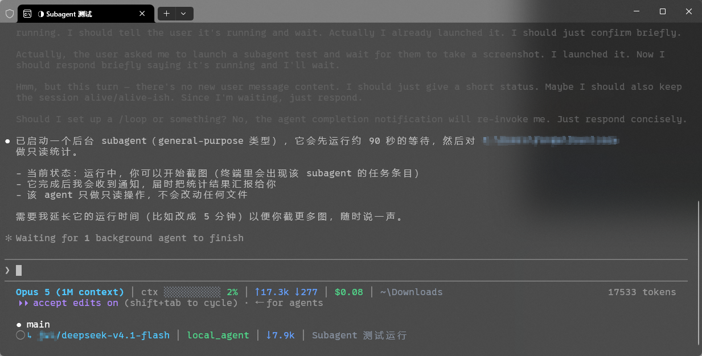

# cc-status-line

适配 [Claude Code](https://claude.com/claude-code)、[Antigravity CLI (`agy`)](https://antigravity.google)、[OpenAI Codex CLI](https://github.com/openai) 及其他 AI 编程助手的极速、零依赖状态栏 —— 为主会话提供紧凑单行上下文，为运行中的各 Subagent 提供轻量状态行。

[English](README.md) | [中文](README_zh.md)

---

### 效果预览

<!-- 截图放到 assets/preview.png，放进去即可，无需改其他内容。 -->


```text
# Claude Code 会话（包含缓存命中、Git 增删与 OAuth 速率限制）：
Opus 5 │ 就绪 │ (.venv) │ main ● │ +42 -12 │ 上下文 ████░░░░░░ 42% │ ↑15.0k ↓3.2k │ ⚡缓存 80% (12.0k) │ 5h 76% · 2h 15m │ ~/Codes/my-project

# Antigravity CLI 会话（官方 Google OAuth 额度与运行时）：
Gemini 2.5 Pro │ 就绪 │ pnpm │ main ✓ │ 上下文 ████░░░░░░ 42% │ ↑85.0k ↓15.0k │ ⚡缓存 71% (60.0k) │ 5h 80% · 1h │ 7d 94% · 6d │ ~/Codes/my-project

# OpenAI Codex CLI / GPT 会话：
GPT-4o │ main ✓ │ ctx ███░░░░░░░ 26% │ ↑12.0k ↓3.5k │ 5h 85% · 3h │ ~/Codes/my-project

# Subagent 状态行（兼容 Claude Code 与 Antigravity CLI）：
↳ Opus 5 │ Explore │ ctx ███████░░░ 68% │ ↓12.4k │ 查找所有 status line 配置
↳ Gemini 2.5 Flash │ Researcher │ ctx ███░░░░░░░ 30% │ ↓5.4k │ 检索代码库
```

### Subagent 状态

subagent 状态行是分阶段拼出来的。下面两张截图是同一个 agent 在不同阶段的样子：

<!-- 截图放到 assets/subagent_new.png 和 assets/subagent_token.png，放进去即可，无需改其他内容。 -->



- **刚打开** —— 状态行由模型、agent 类型/角色、任务描述/提示词，以及已知上下文窗口时的进度条拼出，此时还没有 token 计数。
- **有 token 数据时** —— 随着 agent 运行，`↓` token 片段会填充进来。

两种阶段都做了降级：某个片段的数据缺失时会被直接省略，而不是渲染成占位符。

### 特性

- **多 CLI 兼容** —— 自动检测并支持 Claude Code、Antigravity CLI（`agy`）、OpenAI Codex CLI（`codex`）以及通用 AI 编码 CLI。
- **Prompt 缓存命中率** —— 自动统计并显示 Prompt Cache 命中率与节省 Token 量（如 `⚡缓存 80% (12.0k)`）。
- **虚拟环境与运行时识别** —— 自动识别激活环境与项目类型（Python `.venv`/`conda`、Node `pnpm`/`bun`/`yarn`/`.nvmrc`、Go `go.mod`、Rust `cargo`/`rust-toolchain` 等）。
- **Git 实时增删改统计** —— 实时显示工作区相比 HEAD 的增删改代码行（`+42 -12`）。
- **上下文 Token 常驻显示** —— 上下文 token 统计（`↑` 输入、`↓` 输出）在所有会话中全程常驻显示，初始为 `↑0 ↓0`。
- **官方 OAuth 额度识别** —— 自动识别官方 OAuth 订阅，按标准周期显示 `5h`、`7d`、`1m` 等额度剩余与倒计时（如 `5h 76% · 2h 15m │ 7d 59%`），额度充足为绿、警戒为黄、见底为红。
- **上下文用量进度条** —— 按阈值着色，65% 转黄、85% 转红。
- **Git 状态** —— 显示当前分支（detached HEAD 时回退到短 SHA），并用 `✓` / `●` 标记工作区是否干净。
- **花费 / 额度双模** —— API 密钥按 Token 计费显示 USD 金额，官方 OAuth 订阅显示周期额度。
- **交互式 TUI 可视化配置** —— 终端可视化拖拽排序、模块开关及中英双语切换（`python statusline.py config`）。
- **路径缩写** —— `$HOME` 折叠为 `~`，过深的路径折叠为 `…/最后/三级/目录`。
- **Subagent 逐行显示** —— 每个运行中的 subagent 单独一行，全面兼容 Antigravity CLI 的 `role`、`prompt` 及 Claude Code 的子任务。
- **零依赖** —— 只用 Python 3 标准库。无需安装、无需虚拟环境、无需构建。
- **不阻塞输入** —— git 调用最长 0.5 秒超时，任何异常都降级为空字段而不是报错。

### 环境要求

- Python 3.8+
- `PATH` 中有 `git`（可选，缺失时整段 git 信息不显示）
- 终端支持 truecolor，否则 RGB 配色会失真

### 安装配置

#### 方式 A：AI 助手（Claude Code / Codex）一键自动安装配置

你可以直接让你的 AI 助手自动阅读仓库并完成安装配置。将以下指令直接发送给 **Claude Code**、**OpenAI Codex**、**Antigravity** 等助手：

```text
请帮我将当前目录的 cc-status-line 安装并配置到我的 CLI 环境中。请阅读仓库中的 AGENTS.md 指引，自动识别 statusline.py 的绝对路径并安全写入我的配置文件。
```

仓库根目录已提供标准通用的 [AGENTS.md](AGENTS.md) 智能体指引，供各类 AI Agent 自动阅读并执行配置。

---

#### 方式 B：手动配置

1. 克隆仓库到任意位置：

   ```bash
   git clone https://github.com/fangweilong/cc-status-line.git
   ```

2. 根据使用的 CLI 进行配置：

   #### 配置方式 1：Claude Code（`~/.claude/settings.json`）

   ```json
   {
     "statusLine": {
       "type": "command",
       "command": "python /absolute/path/to/cc-status-line/statusline.py",
       "padding": 0
     },
     "subagentStatusLine": {
       "type": "command",
       "command": "python /absolute/path/to/cc-status-line/statusline.py"
     }
   }
   ```

   可参考 [examples/settings.json](examples/settings.json)。（注：`statusline.py` 会根据输入 payload 结构自动识别主状态栏与子任务状态栏，命令末尾显式追加 `main` 或 `subagent` 亦完全兼容）。

   #### 配置方式 2：Antigravity CLI（`~/.gemini/antigravity-cli/settings.json`）

   ```json
   {
     "statusLine": {
       "type": "command",
       "command": "python /absolute/path/to/cc-status-line/statusline.py",
       "enabled": true,
       "padding": 0,
       "stack_with_default": false
     }
   }
   ```

   可参考 [examples/antigravity-settings.json](examples/antigravity-settings.json)。亦可在 `agy` 交互界面中直接执行 `/statusline python /path/to/statusline.py`。

   #### 配置方式 3：OpenAI Codex CLI（`~/.codex/config.toml`）

   Codex CLI 原生在 `~/.codex/config.toml` 中通过内置字段管理底部状态栏：

   ```toml
   [tui]
   status_line = [
       "model-with-reasoning",
       "project-root",
       "current-dir",
       "git-branch",
       "five-hour-limit",
       "weekly-limit",
       "context-used",
       "context-window-size",
       "used-tokens"
   ]
   status_line_use_colors = true
   ```

   可参考 [examples/codex-config.toml](examples/codex-config.toml)。
   若你在自定义脚本、tmux 或 Shell 包装器中使用 Codex，亦可直接调用：
   `python /absolute/path/to/cc-status-line/statusline.py codex`

3. 重启 CLI 或执行 `/statusline` 确认配置生效。

#### 路径注意事项

- 即使在 Windows 上也请使用**正斜杠**：`python C:/tools/cc-status-line/statusline.py main`。
- 路径含空格时请加引号。
- Windows 上 `python` 必须能解析到真实解释器。若你依赖 `py` 启动器，请把命令里的 `python` 换成 `py`。
- macOS / Linux 下也可以加执行权限后直接用 shebang：

  ```bash
  chmod +x statusline.py
  ```

### 用法与模式

```bash
# 主会话状态行（自动识别 Claude Code / Antigravity CLI / Codex / 通用 CLI）
python statusline.py main

# 显式指定 CLI 类型：
python statusline.py main --cli antigravity
python statusline.py main --cli claude
python statusline.py main --cli codex

# 简写别名：
python statusline.py agy
python statusline.py antigravity
python statusline.py claude
python statusline.py cc
python statusline.py codex

# 交互式 TUI 可视化配置向导（支持模块开关、拖拽排序、双语切换）：
python statusline.py config

# Subagent 模式（输出各子任务 JSON）：
python statusline.py subagent
```

### 可视化 TUI 配置向导

无需手动编辑 JSON，在终端中直观调整模块开关、前后顺序和语言：

```bash
python statusline.py config

# 或使用单体可执行文件：
statusline config
```

配置文件自动保存于 `~/.config/cc-status-line/config.json`。

| 按键 | 功能 |
| --- | --- |
| `↑` / `↓` | 在模块列表中上下移动光标 |
| `空格` (Space) | 开启或关闭当前模块 (`[x]` / `[ ]`) |
| `+` / `-` (或 `K` / `J`) | 调整模块显示的前后顺序 |
| `L` / `Tab` | 切换界面语言（中文 / English） |
| `回车` (Enter) | 保存并立即生效配置 |
| `Q` / `Esc` | 放弃修改直接退出 |

#### 11 个内置可配置模块清单

| 模块标识 | 模块名称与说明 | 默认状态 | 说明 |
| --- | --- | --- | --- |
| `model` | 模型标识（如 `Opus 5`、`Gemini 2.5 Pro`） | 开启 | 默认首位展示 |
| `state` | 运行状态（`就绪` / `运行中` / `思考中` / `Auth`） | 开启 | 依状态着色青/黄/灰 |
| `env` | 虚拟环境与运行时识别 | 开启 | 识别 Python `.venv`/`conda`、Node `pnpm`/`bun`、Go、Rust 等 |
| `git` | Git 分支与状态（`main ✓` / `main ●`） | 开启 | detached HEAD 时回退至短 SHA |
| `git_stat` | Git 增删改代码行统计（`+42 -12`） | 开启 | 实时统计未提交的修改，无改动自动省略 |
| `context` | 上下文用量进度条与百分比 | 开启 | 65% 转黄、85% 转红 |
| `tokens` | Token 计数器（`↑` 输入、`↓` 输出） | 开启 | 流式生成中带 `…` 动态提示 |
| `cache` | Prompt 缓存命中率与减免量（`⚡缓存 80% (12.0k)`） | 开启 | 无缓存字段时自动干净省略 |
| `quota` | 官方 OAuth 配额（`5h` / `7d` / `1m` 及重置倒计时） | 开启 | 自动适配官方 OAuth 订阅会话 |
| `cost` | 会话累计花费（`$0.37`） | 开启 | 适用于 API Key 按量计费会话 |
| `cwd` | 紧凑工作区路径 | 开启 | `$HOME` 折叠为 `~`，深层目录智能省略 |

> [!NOTE]
> **关于各 CLI 的缓存支持**：缓存命中率（`cache`）依赖上游 CLI 在 statusline payload 中提供缓存数据。Claude Code (`cc`) 与 OpenAI Codex (`codex`) 原生支持导出缓存指标。Antigravity CLI (`agy`) 目前官方 payload 尚未开放缓存指标字段，因此在 `agy` 环境下该模块自动干净省略，不显示占位符或报错。

### 单体二进制文件运行（可选，免 Python 环境）

如果你不想在目标环境配置 Python 环境，也可以使用单体二进制文件：
- 仓库通过 GitHub Actions 为 **Windows (`x86_64` / `arm64`)**、**macOS (`Apple Silicon arm64`)**、**Linux (`x86_64` / `arm64`)** 在发布 Release 时自动编译单体可执行文件。
- 直接从 GitHub Releases 页面下载对应系统的可执行文件放入 `PATH` 或项目目录：
  ```bash
  # Windows
  statusline.exe main
  statusline.exe config

  # Linux / macOS
  chmod +x statusline
  statusline main
  statusline config
  ```
- 也可在本地使用 PyInstaller 自行打包：
  ```bash
  pip install pyinstaller
  pyinstaller --onefile --clean --name statusline statusline.py
  ```

### 错误提示

入口脚本会校验模式参数，不会静默失败。由于状态栏没有 stderr 通道，所有错误都打印到 **stdout**，输出为一行可见的提示：

```text
⚠ statusline: missing mode argument │ check your settings.json │ statusline.py <main|subagent|agy|claude|codex> [--cli <name>]
⚠ statusline: unknown mode 'mian' │ expected main, subagent, agy, claude, or codex │ statusline.py <main|subagent|agy|claude|codex> [--cli <name>]
⚠ statusline: KeyError: 'foo' │ render failed │ statusline.py <main|subagent|agy|claude|codex> [--cli <name>]
```

| 情况 | 行为 | 退出码 |
| --- | --- | --- |
| 未传参数 | 输出 `missing mode argument` 提示行 | 1 |
| 参数不合法 | 输出 `unknown mode '...'` 提示行 | 1 |
| 渲染过程中出现未预期异常 | 输出 `异常类型: 消息` 提示行 | 1 |
| stdin JSON 为空或格式错误 | 不报错，输出最小可用内容（有意为之） | 0 |

### 输入字段与官方 OAuth 额度

渲染逻辑做了充分的容错，下表字段按顺序逐个尝试，缺失即跳过。

| 片段 | 读取字段（命中即用） |
| --- | --- |
| 模型 | `model.display_name` → `model.name` → `model.id` → CLI 默认值（`Gemini` / `Claude` / `Codex` / `Agent`） |
| 状态 | `agent_state` → `state`（如 `Idle`、`Thinking`、`Auth`） |
| 运行环境 | `VIRTUAL_ENV` / `CONDA_DEFAULT_ENV` 或当前项目环境标识（`.venv`、`pnpm-lock.yaml`、`go.mod` 等） |
| Git 状态 | 当前分支与工作区状态（`✓` / `●`） |
| Git 统计 | `git diff HEAD --shortstat` 增删改统计（`+X -Y`） |
| 工作目录 | `workspace.current_dir` → `workspace.project_dir` → `cwd` |
| 上下文 | `context_window.used_percentage` → `100 - context_window.remaining_percentage` |
| Token | `context_window.total_input_tokens` → `context_window.input_tokens` → `input_tokens` → `tokens.input`，输出同理 |
| 缓存命中 | `cache_read_input_tokens` → `tokens.cached` → `prompt_tokens_details.cached_tokens` |
| 花费 | `cost.total_cost_usd` |
| 额度 | `quota.remaining_fraction` / `quota.<model>.remaining_fraction`（支持 `reset_in_seconds` 或 `reset_time` 倒计时） |

#### 官方 OAuth 判定规则

1. 优先读取输入 payload 中的鉴权信息（`auth.type` 或 `auth_type` 为 oauth / google）。
2. 读取 payload 或本地缓存中的 `quota` 数据。
3. 检测本地 Google OAuth 登录凭据（`~/.gemini/oauth_creds.json` 等）。
4. 若显式配置了 API Key 环境变量（如 `GEMINI_API_KEY` / `GOOGLE_API_KEY` / `OPENAI_API_KEY`），则判定为 API 模式，不显示 OAuth 额度。
5. 额度颜色：**绿色**（>= 50%）、**黄色**（20% ~ 50%）、**红色**（< 20%）。

### 项目结构

```text
statusline.py            # 入口脚本（支持 main | subagent | agy | claude | codex）
AGENTS.md                # 跨 AI Agent 通用阅读与安装指南
statusline/
  main.py                # 主会话状态行渲染
  subagent.py            # 各 subagent 状态行渲染
  quota.py               # 官方 OAuth 判定与配额渲染
  common.py              # stdin 解析、CLI 自动识别、git、路径、进度条
  colors.py              # ANSI truecolor 调色板
examples/
  settings.json              # Claude Code 配置示例
  antigravity-settings.json  # Antigravity CLI 配置示例
  codex-config.toml          # OpenAI Codex CLI 配置示例
```

### 许可证

[MIT](LICENSE)
